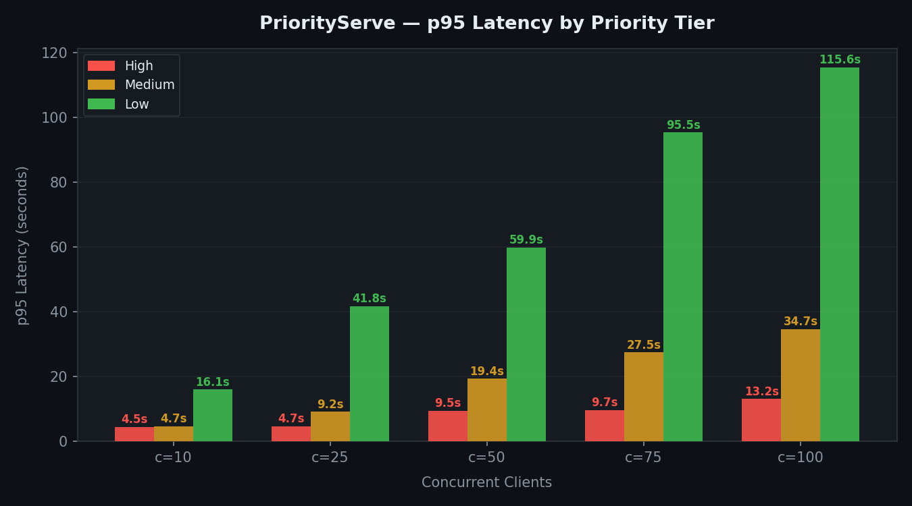

# PriorityServe

Priority-aware request scheduling for local LLM inference.

Existing local LLM servers (Ollama, llama.cpp server) treat all requests equally — a premium user's request waits behind a batch job with no differentiation. PriorityServe sits in front of llama.cpp and routes requests through a three-tier priority queue, guaranteeing that high-priority requests are always served first.

---

## Benchmark Results

60 requests, 10% high / 20% medium / 70% low priority distribution, Llama 3.2 3B Q4 on Apple M1.

| Concurrency | High p95 | Medium p95 | Low p95   | Separation |
|-------------|----------|------------|-----------|------------|
| 10 clients  | 4,500ms  | 4,713ms    | 16,065ms  | **3.6x**   |
| 25 clients  | 4,654ms  | 9,168ms    | 41,813ms  | **9.0x**   |
| 50 clients  | 9,472ms  | 19,396ms   | 59,901ms  | **6.3x**   |
| 75 clients  | 9,657ms  | 27,483ms   | 95,452ms  | **9.9x**   |
| 100 clients | 13,172ms | 34,685ms   | 115,579ms | **8.8x**   |

**High priority p95 grows from 4.5s to 13s across a 10x increase in load. Low priority degrades from 16s to 116s over the same range. Latency separation holds consistently between 6–10x at every concurrency level.**



---

## How It Works

```
Client Request (X-Priority: high/medium/low)
          ↓
    HTTP Server (Go, :8080)
          ↓
  ┌───────────────────┐
  │   Priority Queue   │  ← high always dispatched first
  │  high / med / low  │
  └───────────────────┘
          ↓
    Scheduler (strict tier order)
          ↓
    Worker Pool (N concurrent workers)
          ↓
    llama.cpp (Metal, :8081)
          ↓
    Response streamed back
```

Three FIFO queues, one per tier. The scheduler drains high before medium, medium before low. Under contention, high-priority requests jump the entire queue regardless of arrival order.

---

## Features

- **OpenAI-compatible API** — drop-in for any OpenAI SDK client, just add `X-Priority` header
- **Live dashboard** — real-time queue depths, worker utilization, per-request latency at `/ui`
- **Prometheus metrics** — `request_latency_seconds` histogram per tier at `:9090/metrics`
- **Backpressure** — unbuffered worker channel blocks the scheduler until a slot is free; queue returns 503 when full
- **Client disconnect handling** — requests whose client disconnected while queued are dropped, not processed

---

## Quick Start

See [QUICKSTART.md](QUICKSTART.md) for full setup instructions.

```bash
# Terminal 1 — llama.cpp backend
./scripts/start_llamacpp.sh

# Terminal 2 — PriorityServe
go run ./cmd/priorityserve
```

Send a request:

```bash
curl http://localhost:8080/v1/chat/completions \
  -H "Content-Type: application/json" \
  -H "X-Priority: high" \
  -d '{"model":"llama3.2","messages":[{"role":"user","content":"Hello"}]}'
```

---

## Load Testing

```bash
# Run at three concurrency levels
go run ./cmd/loadtest/ -n 60 -c 10 -high 10 -med 20
go run ./cmd/loadtest/ -n 60 -c 25 -high 10 -med 20
go run ./cmd/loadtest/ -n 60 -c 50 -high 10 -med 20
```

Results are saved as JSON to `results/`. Use `scripts/plot_benchmark.py` to generate the chart.

---

## Configuration

| Variable | Default | Description |
|----------|---------|-------------|
| `PS_LISTEN_ADDR` | `:8080` | API server address |
| `PS_BACKEND_URL` | `http://localhost:8081` | llama.cpp URL |
| `PS_WORKER_COUNT` | `2` | Concurrent inference workers |
| `PS_QUEUE_DEPTH` | `100` | Max queued requests per tier |
| `PS_METRICS_ADDR` | `:9090` | Prometheus metrics address |

---

## Stack

| Layer | Choice |
|-------|--------|
| Server | Go — goroutines map cleanly to concurrent request handling |
| Inference | llama.cpp — Metal on M1, proven, no CGo required |
| Model | Llama 3.2 3B Q4_K_M |
| Metrics | Prometheus |
| Dashboard | Server-sent events + vanilla JS |
